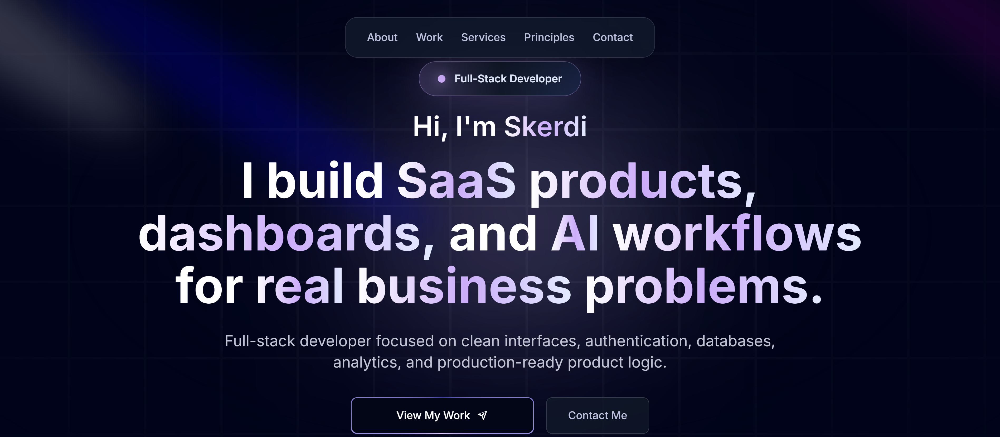
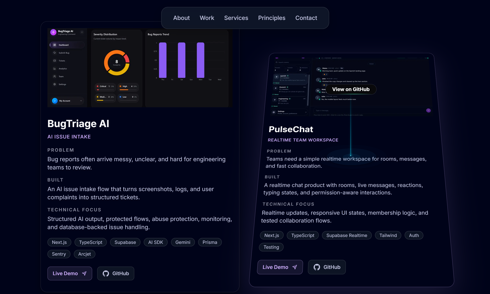

# Skerdi Portfolio

A modern full-stack developer portfolio built to present my projects, skills, and product-building style.

The portfolio focuses on practical web products, SaaS apps, dashboards, client portals, internal tools, AI workflows, and production-ready application details.

## Live Site

[View the deployed portfolio](https://skerdi-portfolio.vercel.app)

## Overview

This portfolio is designed to show how I think about building real web products, not just static pages.

It highlights full-stack applications, AI workflows, dashboards, internal tools, responsive design, monitoring, and deployment polish.

The goal is simple: present my work in a clear, polished, and practical way for freelance clients, collaborators, and job opportunities.

## Screenshots

| Hero                                                   | Selected Work                                                            |
| ------------------------------------------------------ | ------------------------------------------------------------------------ |
|  |  |

## Main Sections

### Hero

A clear introduction to who I am and what I build.

### About

A short overview of my focus as a full-stack developer.

### Work

Project cards showing the problem, what I built, technical focus, stack, GitHub links, and live demos.

### Services

A simple breakdown of the products I build, including MVPs, dashboards, AI workflows, and full-stack product polish.

### Principles

How I approach product building, clean UI, reliability, and iteration.

### Contact

A simple way for people to reach out for freelance work, collaborations, or opportunities.

## Tech Stack

This repository is implemented with:

- Next.js
- React
- TypeScript
- Tailwind CSS
- Vercel

## Getting Started

Install dependencies:

```bash
npm install
```

Run the development server:

```bash
npm run dev
```

Open the app in your browser:

```txt
http://localhost:3000
```

## Available Scripts

```bash
npm run dev      # Start the development server
npm run build    # Create a production build
npm run start    # Run the production build locally
npm run lint     # Check linting issues
npm run typecheck # Check TypeScript types
npm run deploy   # Deploy to Vercel
```

## Project Goals

This portfolio was built to be fast, clear, responsive, easy to maintain, and focused on real project proof.

It represents the type of work I want to do: useful web apps, dashboards, AI workflows, and production-ready product experiences.
